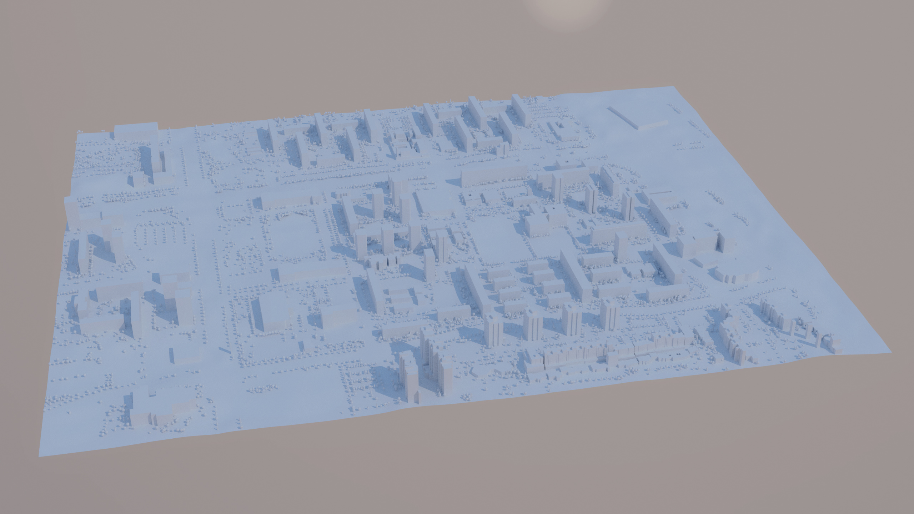

# Zagreb District Model Based on Real Data
BSc Thesis at FER under the mentorship of prof. dr. sc. Željka Mihajlović

---

## Abstract

This thesis examines the procedure of automatic computer generation of a three-dimensional model of an arbitrary Zagreb district.
The discussion is accompanied by the implementation of the solution in software using the *Python* programming language in the form of an add-on for *Blender* toolset.
The model is based on accurate and publicly available data on terrain, buildings and trees, and is made in 1 : 1 ratio.
NASA’s satellite images created using the ASTER sensor, spatial geoinformation database *OpenStreetMap* and the Zagreb Green cadastre are described and used as data sources.
The generated city model consists of meshes without textures representing the terrain, buildings with flat roofs and trees.

**Keywords:** 3D city model, 3D geoinformation, interactive visualization, Zagreb, OpenStreetMap, Blender, Python, Unreal Engine

---

## Examples

**Districts** contains generated models of several Zagreb districts.  
[Utrina.fbx](Examples/Districts/Utrina.fbx) is the largest generated example, covering an area of <code>1.42 km2</code>.
It contains approximately `320` buildings and `7100` trees.
The entire model has almost `1.5` million triangles and over `750 000` vertices.
Render of the entire area is shown below.

**UE4_Cathedral** is an Unreal Engine 4 project for a demonstrative third person game.
The map is based on the area around the Zagreb Cathedral ([Cathedral.fbx](Examples/Districts/Cathedral.fbx)).
Game screenshot can be seen below.  
Unreal Engine `4.22.3` was used to create the project.
Newer versions such as `4.25` are known to have bugs causing the Mannequin to move extremely slowly or not at all.

**UE4_Cathedral_Build_Win64** is a standalone build of the *UE4_Cathedral* project for 64-bit Windows.
Only the DirectX Runtime is required to run the game.
Unreal Engine is not needed.

---

